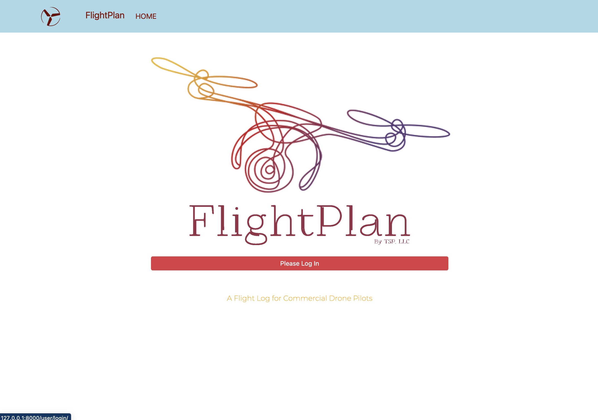
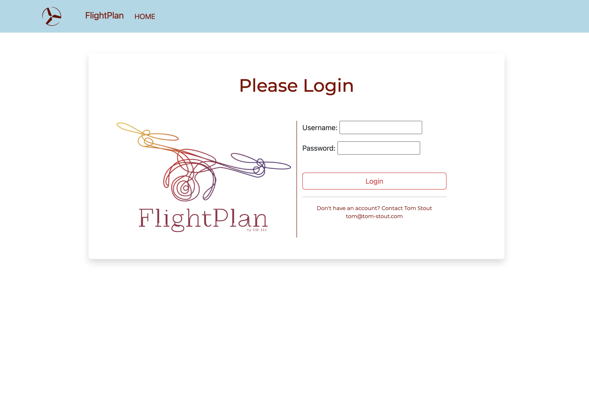
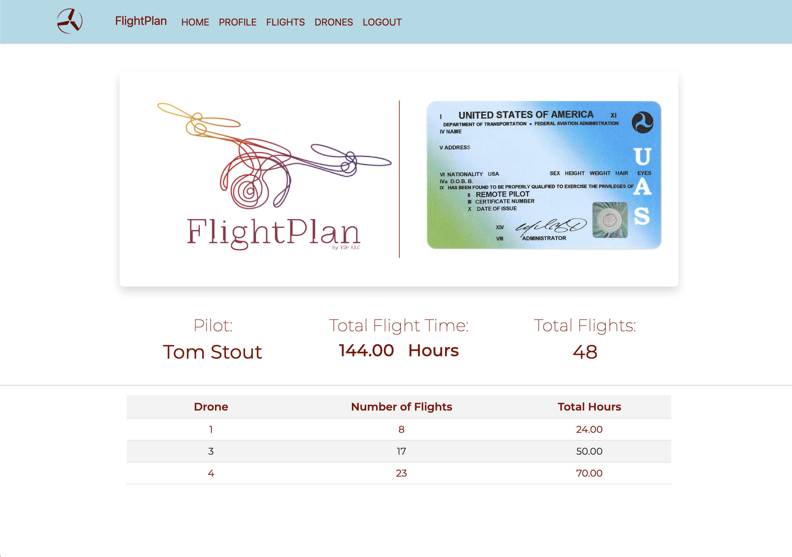
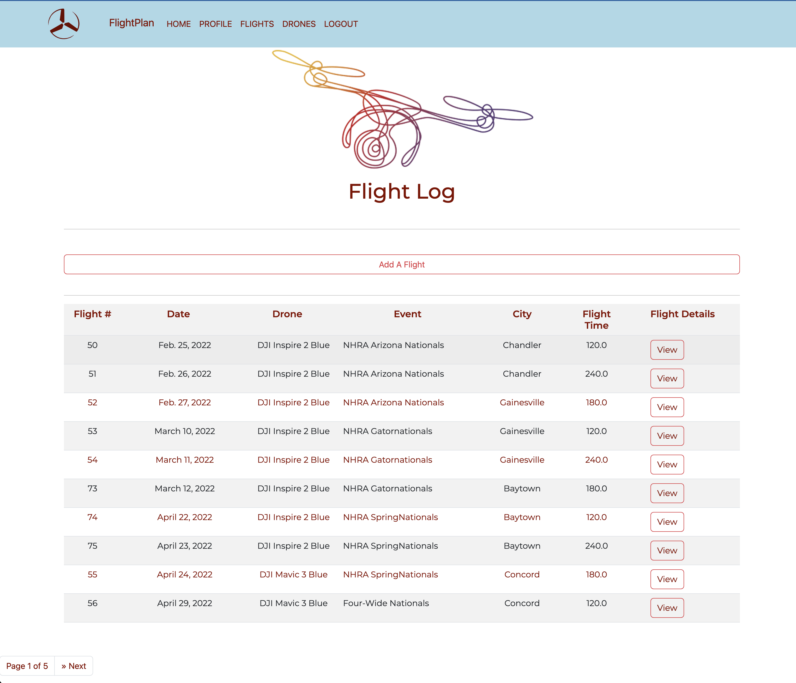
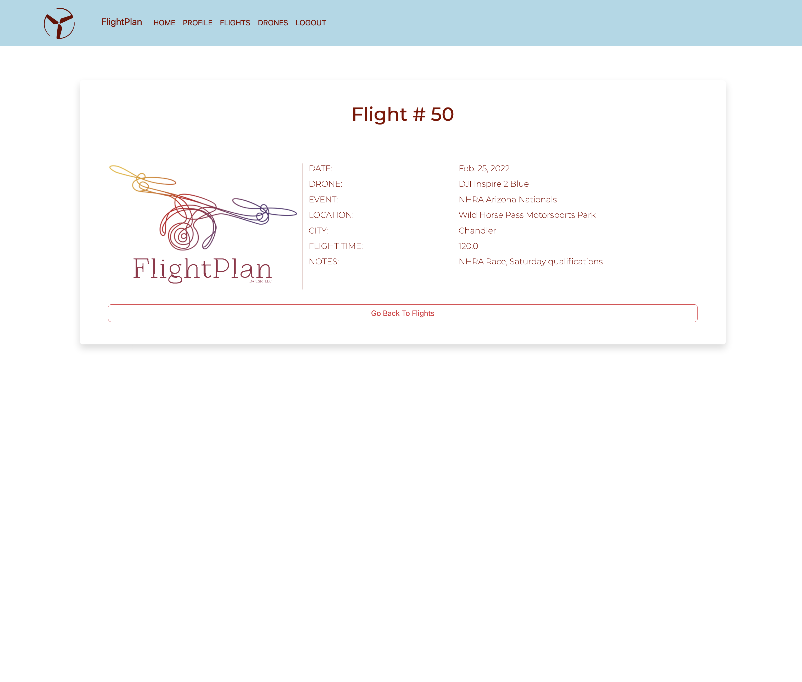
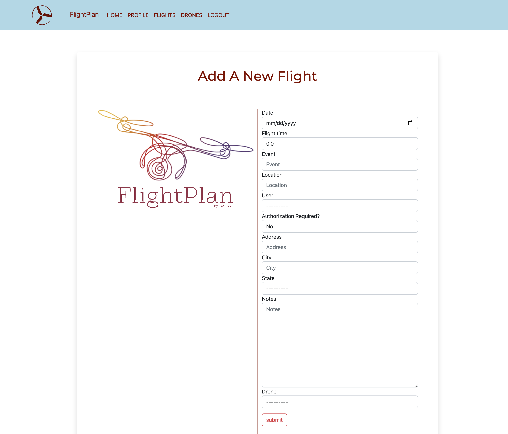
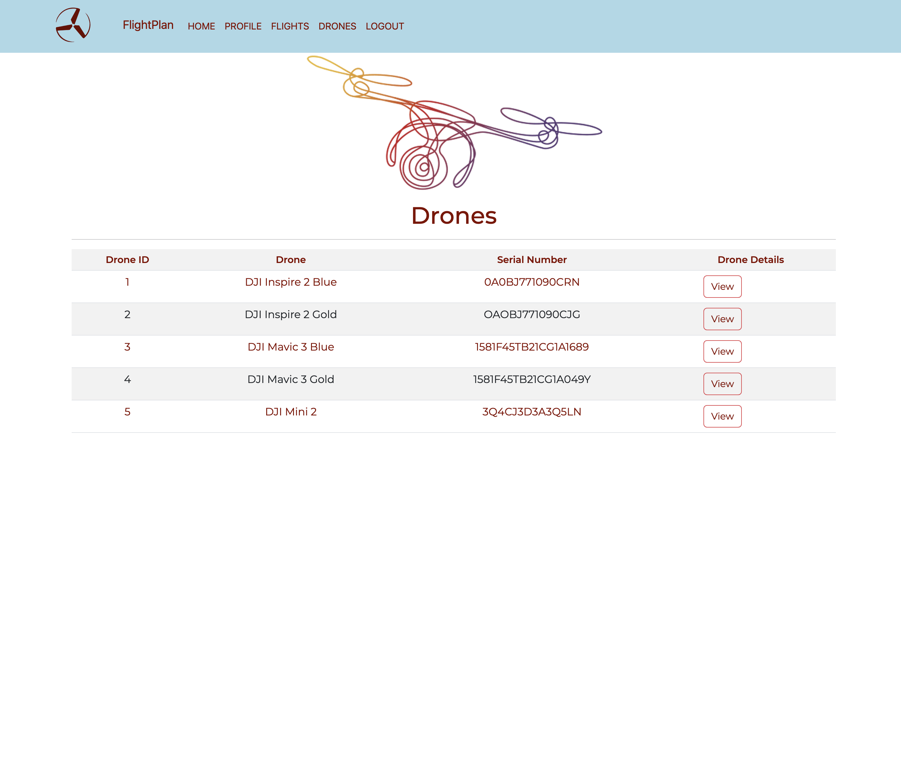
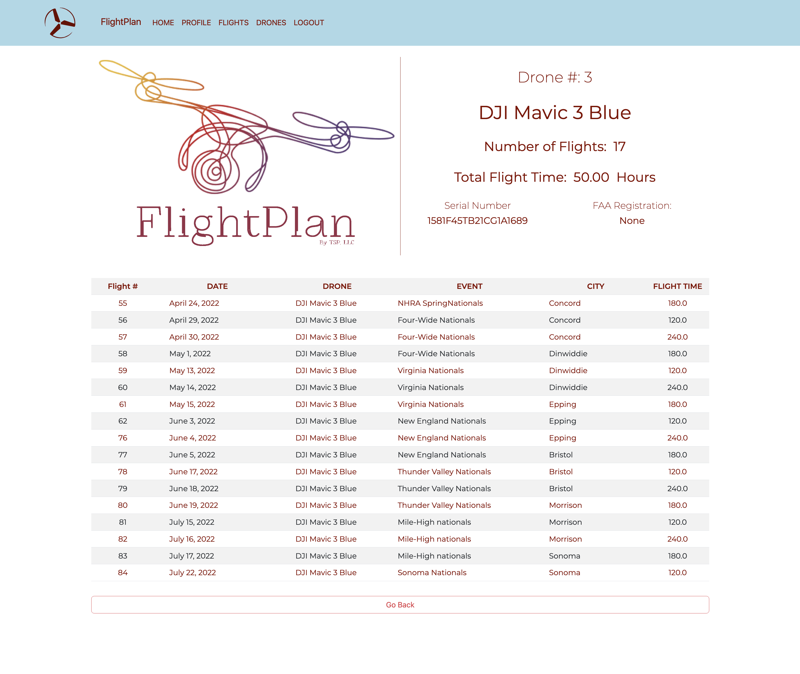
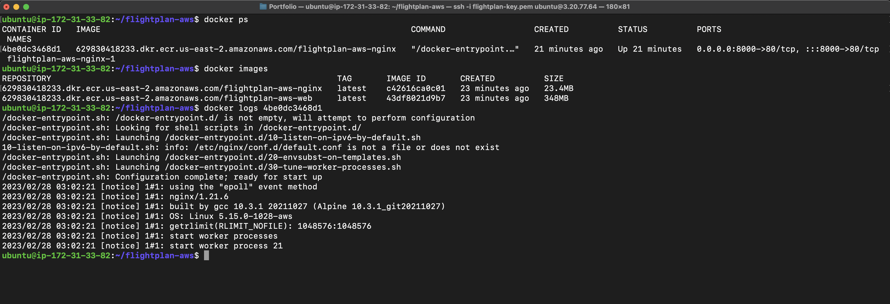
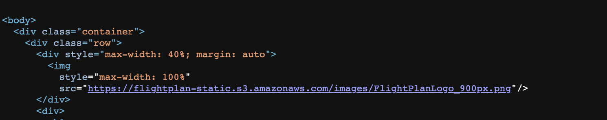

 

<h1 align="center">FlightPlan</h1>

> FlightPlan is an application I created to maintain a log of drone flights. I am a commercial drove pilot and fly for live television broadcasts, often in locations that require FAA approval. For this reason, I am required to keep a flight log. I also keep a flight log to keep track of flight time for each of my drones.

## Technology Stack:

> 

  

## My goal for this application is:
1. Maintain pilot flight records
2. Maintain flight logs
3. Maintain drone records  

### 1.  Pilot Information:
* Total hours flown
* Time flown, by Drone
* FAA license information  

### 2. Flight Information:
* Total hours flown by pilot
* Total hours flown by drone
* Flight Information:
    - Location
    - Drone
    - Time
    - Approval required for flight
    - Notes  
            

### 3. Drone information
* Serial Number
* FAA Registration Number
* FAA Renewal Date  

---

## My database includes:
-   User tables for login and authentication
-   Drones Table
-   Flights Table
-   Profiles Table  

### Relationships:
1. Flights - Profile: Foreignkey
2. Flights - Drones: Many To Many
3. User - Profile: One To One  

### CRUD Operations:
- Drones 
- Flights  

___

<h1 align="center">Links</h1>

* GitHub Local Version:  https://github.com/Tom-Stout325/flightplan-local.git

* GitHub AWS Version:  https://github.com/Tom-Stout325/flightplan-aws.git

* Docker Hub:  https://hub.docker.com/u/tomstout325  

___

<h1 align="center">Instructions</h1>

1. Create a PostgreSQL database:  
    - drones

2. A sample database is provided:
    - Flights-Drones.sql
    - Copy the SQL statments into PGAdmin and run

3. Create a virtual environment
    - python3 -m venv venv

4. Run virtual environment:
    - source venv/bin/activate

5. Install packages:    
    - pip install -r requirements.txt

<h1 align="center">Screenshots</h1>

> 

